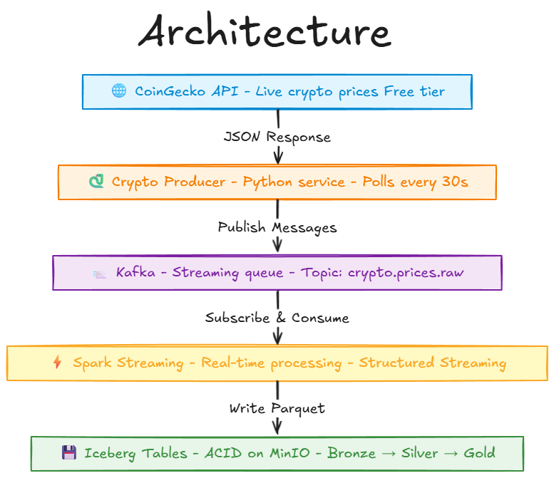

# PART-B: Streaming Infrastructure

**← [Back to Main Repository](../README.md) | ⚠️ Prerequisites: [Complete PART-A first](../PART-A/README.md)**

Welcome to the streaming layer! This is where things get exciting - we're adding real-time data ingestion capabilities to your lakehouse.

PART-B provides Kafka infrastructure for message streaming, along with a working crypto price producer that demonstrates how to build real-time data pipelines. Think of this as your data highway - constantly moving fresh data into your lakehouse.

## What You'll Get

Streaming infrastructure including:
- Kafka cluster for message streaming
- Zookeeper for Kafka coordination
- Kafka UI for monitoring topics and messages
- Crypto price producer (demonstration)
- Network connectivity to PART-A infrastructure

**For the complete crypto analytics project**, see [PART-C: Projects](../PART-C/README.md).

## Architecture Overview



**Network:** All services run on the `dasnet` Docker network created by PART-A. This lets them access MinIO and Hive Metastore from the core infrastructure.

---

## Quick Start

**Good news!** If you followed the [main README](../README.md), everything is already running!

The main README Quick Start guide already:
-  Started PART-A (MinIO, Hive, Spark) ✅
-  Started PART-B (Kafka, Producer) ✅
-  Configured all services ✅

**You're all set!** Skip to [Verify Everything is Running](#verify-everything-is-running) below to confirm it's working.

---

### If You Started Directly in PART-B (Standalone Setup)

Only use this if you skipped the main README and want to set up PART-B independently.

**Step 1: Ensure PART-A is Running**

```bash
docker ps --filter "name=hive-minio" --filter "name=hive-metastore"
```

Both containers must be running. If not, go to [PART-A README](../PART-A/README.md) first.

**Step 2: Launch Kafka & Crypto Producer**

| OS         | Commands                                                                                  |
|------------|-------------------------------------------------------------------------------------------|
| Mac/Linux  | `cd PART-B`<br>`chmod +x setup.sh`<br>`./setup.sh`                                        |
| Windows    | `cd PART-B`<br>`Set-ExecutionPolicy -Scope Process -ExecutionPolicy Bypass`<br>`./setup.ps1`|

---

## Verify Everything is Running

Let's make sure all the streaming components are up and healthy. This quick check confirms Kafka and the producer are working:

```bash
docker ps | grep crypto
```

**You should see these four containers running:**
- `crypto-zookeeper` - Running (Kafka's coordinator)
- `crypto-kafka` - Running (healthy) - The message broker
- `crypto-kafka-ui` - Running - Web interface for monitoring
- `crypto-producer` - Running - Fetching and streaming crypto prices

**All running?** Perfect! Let's see the data.

### Access Your Services

Now for the fun part - let's see your streaming data in action!

| Service | URL | What You'll See |
|---------|-----|---------------|
| Kafka UI | http://localhost:8080 | Topics, messages, consumer groups |
| Jupyter Notebook | http://localhost:8888 | From PART-A (for Spark queries) |

**Try this:** Open Kafka UI at http://localhost:8080 and navigate to the topic `crypto.prices.raw`. You should see messages flowing in every 30 seconds - that's live cryptocurrency price data streaming into your lakehouse!

**Pretty cool, right?** This is real-time data engineering in action.

---

## What's Included

### Services

| Service | Purpose | Port |
|---------|---------|------|
| **Zookeeper** | Kafka coordination | 2181 |
| **Kafka** | Message streaming | 9092 (internal), 9093 (external) |
| **Kafka UI** | Web interface for monitoring | 8080 |
| **Crypto Producer** | Example data generator | - |

### Demonstration: Crypto Price Streaming

PART-B includes a cryptocurrency price producer that demonstrates real-time data streaming:

**What it does:**
- Fetches live crypto prices from CoinGecko API every 30 seconds
- Publishes to Kafka topic `crypto.prices.raw`
- Includes 10 cryptocurrencies (Bitcoin, Ethereum, etc.)
- Wraps data with metadata for tracking

**View the data:**
1. Open Kafka UI: http://localhost:8080
2. Navigate to Topics → `crypto.prices.raw`
3. View live messages arriving every 30 seconds

**Producer code:** [`producers/crypto_producer.py`](producers/crypto_producer.py)

---

## Using This Infrastructure

PART-B provides the streaming layer for your projects. The crypto producer is a working example you can:

- **Study** - Learn how to build producers
- **Modify** - Change API endpoints or frequency
- **Replace** - Build your own producers for different data sources

**Ready to build a complete project?**  
📖 **[Go to PART-C: Crypto Analytics Project](../PART-C/README.md)** to see how to consume this streaming data, transform it through Bronze/Silver/Gold layers, and build analytics.

---

## Data Structure Example

The crypto producer sends JSON messages in this format:

```json
{
  "status": "success",
  "data": {
    "bitcoin": {
      "usd": 92937,
      "usd_market_cap": 1855524642938.09,
      "usd_24h_vol": 91517389314.45,
      "usd_24h_change": 6.77,
      "last_updated_at": 1764758514
    },
    "ethereum": { ... }
  },
  "api_call_timestamp": "2025-12-03T10:42:30.109530",
  "http_status_code": 200,
  "source_system": "coingecko_v3",
  "ingestion_timestamp": "2025-12-03T10:42:30.110290"
}
```

**For detailed schema design and data modeling,** see [PART-C: Crypto Analytics](../PART-C/crypto-analytics/data-modeling/).

---

## Managing PART-B

Need to manage your streaming infrastructure? Here are the essential commands:

### Daily Operations

**Start PART-B:**
```bash
cd PART-B
docker-compose up -d
```

**Stop PART-B (preserves data):**
```bash
cd PART-B
docker-compose down
```

**Check status:**
```bash
docker ps | grep crypto
```

### Viewing Logs

**All services:**
```bash
cd PART-B
docker-compose logs -f
```

**Specific service:**
```bash
docker logs -f crypto-producer  # See API calls and data fetching
docker logs -f crypto-kafka      # Kafka broker logs
docker logs -f crypto-kafka-ui   # UI service logs
```

### Restarting Services

**Restart all PART-B services:**
```bash
cd PART-B
docker-compose restart
```

**Restart specific service:**
```bash
docker-compose restart crypto-producer
docker-compose restart crypto-kafka
```

### After Machine Restart

All PART-B containers are configured with `restart: unless-stopped`. They'll automatically restart when Docker starts. Just give it 30-60 seconds for Kafka to become healthy.

**Verify everything restarted:**
```bash
docker ps | grep crypto
```

---

## Troubleshooting

Running into issues? Here are common problems and solutions:

| Issue | Solution |
|-------|----------|
| "Network dasnet not found" | Start PART-A first: `cd PART-A && ./start.sh` |
| Crypto producer not sending data | Check logs: `docker logs crypto-producer` |
| Kafka UI shows no messages | Wait 30 seconds for first API call, refresh page |
| Spark can't connect to Kafka | Ensure Kafka is healthy: `docker ps \| grep kafka` |
| Port conflicts (8080, 9092) | Stop other services using these ports |

### View Logs

```bash
# Producer logs (shows API calls)
docker logs -f crypto-producer

# Kafka logs
docker logs -f crypto-kafka

# All PART-B services
docker-compose logs -f
```

---

## Customizing the Producer

Want to stream different data? The crypto producer is a template:

**File:** [`producers/crypto_producer.py`](producers/crypto_producer.py)

**Modify it to:**
- Change API endpoints
- Adjust frequency (currently 30 seconds)
- Add new data sources
- Change Kafka topics

**After changes:**
```bash
docker-compose restart crypto-producer
```

---

## Next Steps

1. ✅ **PART-B is running** - Streaming infrastructure ready
2. 📖 **Monitor Kafka UI** - http://localhost:8080 to see live data
3. 🚀 **Build projects** - [Go to PART-C](../PART-C/README.md) to learn data engineering with this streaming infrastructure

---

## What Makes This Real

The crypto producer demonstrates production patterns:
- ✅ **Real APIs** - Live data from CoinGecko (not CSV files)
- ✅ **Error handling** - Status tracking and retry logic
- ✅ **Metadata** - Timestamps for tracking and debugging
- ✅ **Industry Tools** - Kafka, not toy examples

**See it in action in [PART-C: Crypto Analytics Project](../PART-C/crypto-analytics/)**, which shows how to consume this streaming data and build a complete medallion architecture pipeline.
